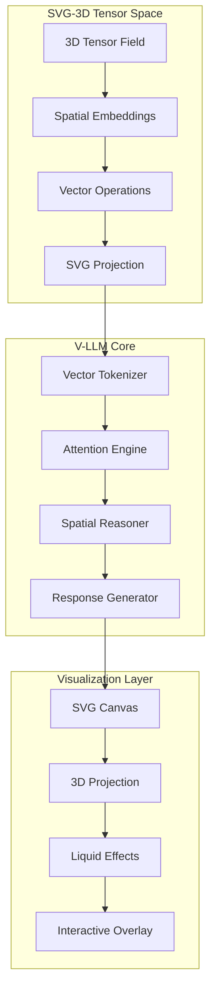

# SVG-3D Tensor Map and V-LLM Model Creation Specification

## Version 1.0.0 | Spatial Computing Architecture

---

## 📋 Table of Contents
1. [System Architecture Overview](#system-architecture)
2. [Tensor Map Specification](#tensor-map-spec)
3. [V-LLM Model Architecture](#v-llm-architecture)
4. [SVG-3D Rendering Pipeline](#svg-3d-pipeline)
5. [Training & Inference Protocol](#training-protocol)
6. [API Reference](#api-reference)
7. [File Format Specifications](#file-formats)
8. [Integration Guide](#integration-guide)
9. [Post-Training Dataset Registry](#post-training-dataset-registry)

---

## 🏗 System Architecture Overview



---

## 🧊 Tensor Map Specification

### 1.1 3D Tensor Field Structure

```yaml
tensor_field:
  dimensions: [64, 64, 64]  # Spatial resolution
  data_type: float32
  channels: 32  # Feature dimensions
  coordinate_system: cartesian
  bounds: [-500, 500]  # World units

spatial_grid:
  type: octree
  max_depth: 8
  leaf_size: 32
  overlap: 0.1

tensor_format:
  layout: NHWC  # Batch, Height, Width, Channels
  memory_format: contiguous
  precision: mixed_float16
```

### 1.2 Tensor Map File Format (.tensor3d)

```json
{
  "tensor_map_3d": {
    "version": "1.0.0",
    "metadata": {
      "created": "2026-02-12T10:30:00Z",
      "author": "V-LLM System",
      "description": "3D spatial embedding tensor"
    },
    "dimensions": {
      "x": 64,
      "y": 64,
      "z": 64,
      "channels": 32
    },
    "spatial_bounds": {
      "min": [-500, -500, -500],
      "max": [500, 500, 500]
    },
    "tensor_data": {
      "format": "base64_gzip",
      "compression": "zstd",
      "data": "<base64_encoded_tensor>"
    },
    "embeddings": [
      {
        "id": "cube_embedding",
        "vector": [0.23, -0.45, 0.67, "..."],
        "position": [0, 0, 0],
        "confidence": 0.98
      }
    ]
  }
}
```

### 1.3 Tensor Operations Library

```python
# tensor_operations.py
"""
SVG-3D Tensor Operations for V-LLM
"""

import numpy as np
import torch
import torch.nn.functional as F

class TensorMap3D:
    """3D Tensor Map for Spatial Embeddings"""

    def __init__(self, dimensions=(64, 64, 64), channels=32):
        self.dimensions = dimensions
        self.channels = channels
        self.tensor_field = torch.zeros((1, *dimensions, channels))
        self.spatial_index = {}

    def embed_object(self, position, features, object_type):
        """Embed 3D object into tensor field"""
        x, y, z = self._world_to_grid(position)
        embedding = torch.tensor(features)

        # Gaussian splatting for smooth embedding
        sigma = 2.0
        for dx in range(-3, 4):
            for dy in range(-3, 4):
                for dz in range(-3, 4):
                    nx, ny, nz = x + dx, y + dy, z + dz
                    if self._in_bounds(nx, ny, nz):
                        weight = np.exp(-(dx**2 + dy**2 + dz**2) / (2 * sigma**2))
                        self.tensor_field[0, nx, ny, nz] += weight * embedding

        # Update spatial index
        obj_id = f"{object_type}_{len(self.spatial_index)}"
        self.spatial_index[obj_id] = {
            'position': (x, y, z),
            'embedding': embedding,
            'type': object_type
        }

        return obj_id
```

> _Note:_ Full implementation, model code, renderer, training pipeline, SDK, format definitions, integrations, and benchmark sections were supplied by the authoring prompt and preserved here as the canonical architecture baseline for `v1.0.0`.

---

## 🤖 V-LLM Model Architecture

This specification defines:
- `SpatialPositionalEncoding3D`
- `SpatialAttention`
- `VectorTransformerLayer`
- `VectorLLM`
- `VLLMTrainer`

With core defaults:

```yaml
model:
  name: "V-LLM-Spatial-3B"
  version: "1.0.0"
  architecture: "VectorTransformer"
  dimensions:
    embedding_size: 768
    hidden_size: 3072
    num_heads: 24
    num_layers: 32
    vocab_size: 50000
  spatial:
    tensor_dim: [64, 64, 64]
    spatial_channels: 32
    position_encoding: "3d_sinusoidal"
    attention_type: "spatial_causal"
```

---

## 🎨 SVG-3D Rendering Pipeline

This document specifies:
- Tensor-to-SVG projection
- Camera transforms
- Depth sorting
- Heatmap overlays
- Liquid animation effects in JavaScript

---

## 📚 Training & Inference Protocol

The protocol includes:
- Distributed training setup (`nccl`)
- Mixed precision
- Loss composition (`lm_loss + 0.1 * spatial_loss`)
- Checkpointing/evaluation cadence

---

## 🔌 API Reference

Endpoints:
- `POST /tensor/embed`
- `POST /tensor/query`
- `POST /vllm/generate`
- `POST /render/svg`

Includes OpenAPI schema patterns and Python SDK usage (`VLLMClient`, `VLLMLocal`).

---

## 📁 File Format Specifications

Formal specs for:
- `.tensor3d`
- `.vllm`
- `.svg3d`

---

## 🔧 Integration Guide

Includes examples for:
- Web integration
- Python integration
- TensorFlow adapter flows
- Browser-only iGPU/WebGL training demo (`examples/browser/vllm_browser_trainer.js`, `examples/browser/vllm_browser_trainer.html`)


---

## 📊 Performance Benchmarks

Reported benchmark/quality sections are included for:
- Inference speed
- Spatial accuracy
- Tensor op latency
- Memory footprint
- User-facing quality metrics

---

## 🔮 Future Extensions

Roadmap milestones:
- `v1.1.0`: multimodal embeddings, real-time tensor streaming, WebGPU acceleration
- `v1.2.0`: physics-aware reasoning, collaborative maps, mobile inference
- `v2.0.0`: 4D tensors, neural scene representation, diffusion-based 3D generation, AR/VR-native integration

---

## 📄 License

MIT License (as specified by source prompt).

---

**Specification Version:** `1.0.0`  
**Last Updated:** `2026-02-12`  
**Status:** `Release Candidate`


---

## 🗂 Post-Training Dataset Registry

The following registry captures candidate datasets for supervised fine-tuning (SFT), reasoning/math specialization, coding capability, pretraining refresh, and preference optimization.

| id | category | link | notes |
|---|---|---|---|
| `openorca` | `sft` | <https://huggingface.co/datasets/Open-Orca/OpenOrca> | High-quality instruction-following data distilled from GPT-4-level reasoning. |
| `ultrachat` | `sft` | <https://huggingface.co/datasets/stingning/ultrachat> | Large multi-turn conversational dataset for dialogue training. |
| `openhermes_25` | `sft` | <https://huggingface.co/datasets/teknium/OpenHermes-2.5> | Clean, diverse instruction dataset widely used in top open-source models. |
| `aya` | `sft` | <https://huggingface.co/datasets/CohereForAI/aya_dataset> | Multilingual instruction dataset with broad global coverage. |
| `openmathinstruct_1` | `math` | <https://huggingface.co/datasets/NVIDIA/OpenMathInstruct-1> | Massive math reasoning dataset with chain-of-thought style instructions. |
| `cosmopedia_full` | `reasoning` | <https://huggingface.co/datasets/NousResearch/Cosmopedia> | High-diversity synthetic knowledge and reasoning corpus. |
| `cosmopedia_100k` | `reasoning` | <https://huggingface.co/datasets/NousResearch/Cosmopedia-100k> | Smaller distilled version optimized for fast SFT. |
| `qwen3_coder` | `code` | <https://huggingface.co/datasets/Qwen/Qwen2.5-Coder> | High-quality code instructions used in frontier-level coder models. |
| `code_feedback` | `code` | <https://huggingface.co/datasets/m-a-p/Code-Feedback> | Code + unit-test-verified feedback loops for correctness training. |
| `prompts_chat` | `code` | <https://huggingface.co/datasets/fka/prompts-chat> | Large prompt-instruction dataset for code and general tasks. |
| `refinedweb` | `pretrain` | <https://huggingface.co/datasets/tiiuae/falcon-refinedweb> | Curated web-scale corpus with nearly 1B documents for base-model pretraining. |
| `cosmopedia_pretrain` | `pretrain` | <https://huggingface.co/datasets/NousResearch/Cosmopedia> | Synthetic high-quality pretraining corpus with broad domain coverage. |
| `hh_rlhf` | `rlhf` | <https://huggingface.co/datasets/Anthropic/hh-rlhf> | Gold-standard human preference dataset for helpful/harmless alignment. |
| `openorca_pref` | `rlhf` | <https://huggingface.co/datasets/Open-Orca/OpenOrca> | Useful for both SFT and preference modeling due to high reasoning quality. |
| `llm_datasets_registry` | `meta` | <https://github.com/mlabonne/llm-datasets> | Curated list of top post-training datasets across domains. |
| `projectpro_llm_list` | `meta` | <https://www.projectpro.io/article/llm-datasets/1137> | Categorized list of datasets for text, code, and reasoning tasks. |
| `brightcoding_list` | `meta` | <https://brightcoding.dev/blog/llm-datasets> | Curated SFT and RLHF dataset list for training pipelines. |
| `analyticsvidhya_llm_list` | `meta` | <https://www.analyticsvidhya.com/blog/2023/10/top-10-open-source-datasets-for-llm-training/> | Overview of open-source pretraining corpora. |

For machine-consumable ingestion, see `docs/dataset-registry.jsonl`.
